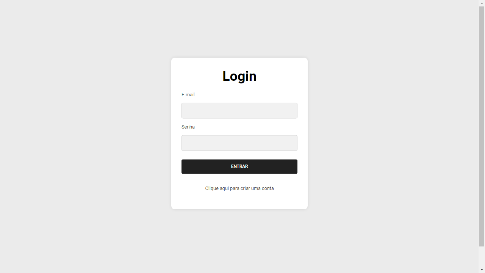
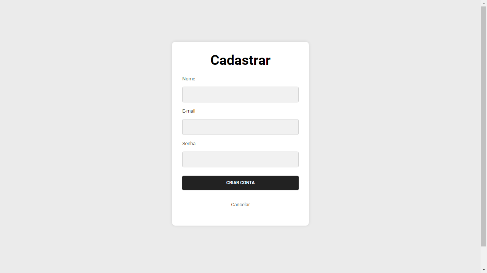
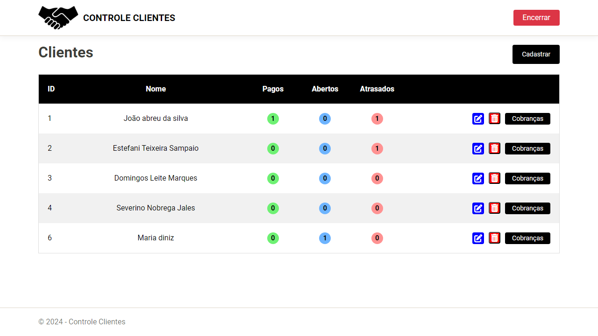
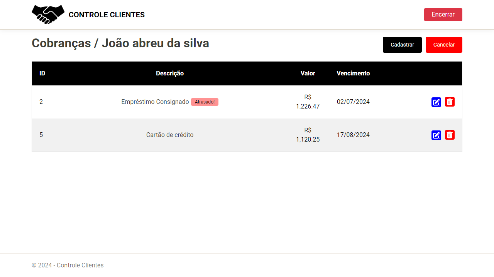
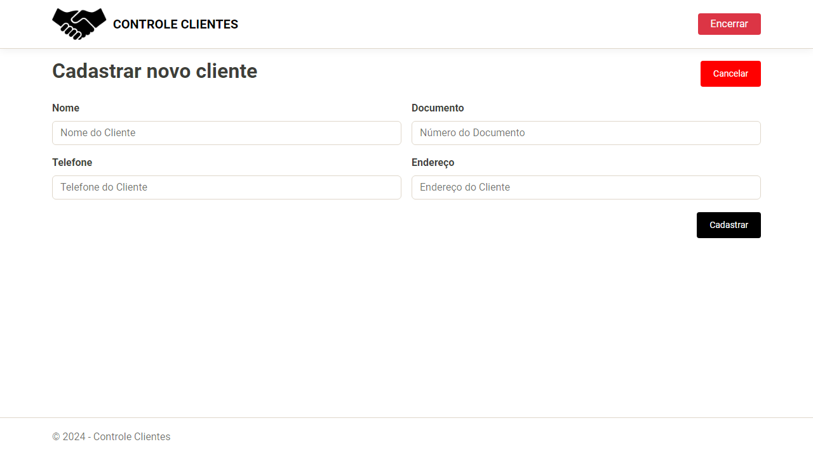
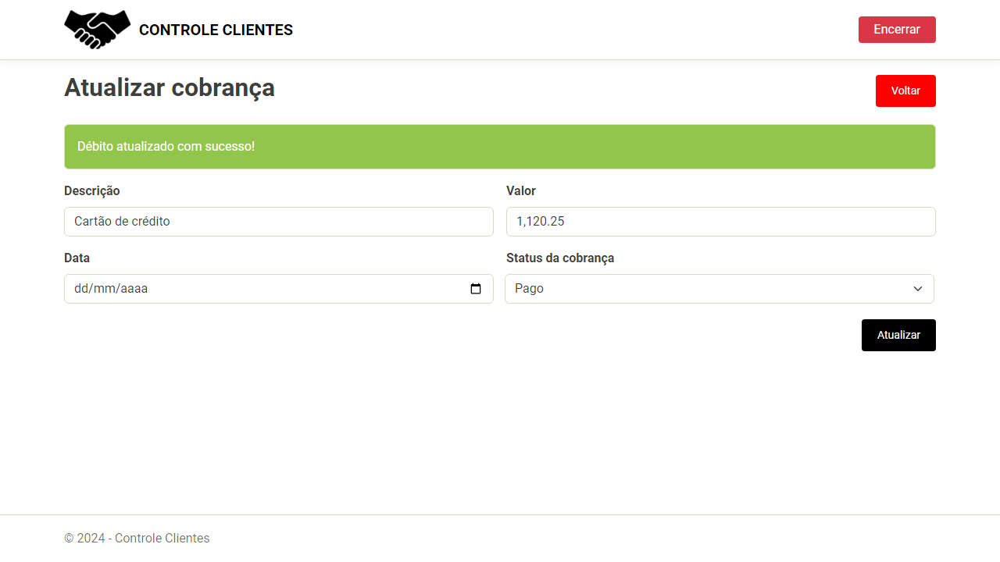

# Controle de Clientes e Dívidas

Este projeto é um sistema para gerenciamento de clientes e suas dívidas, desenvolvido em ASP.NET Core MVC. O sistema oferece uma interface web com páginas Razor, usando para gerar HTML com sintaxe C# e CSS em uma única página, e inclui funcionalidades para autenticação, cadastro e gerenciamento de clientes e suas dívidas.

## Funcionalidades

- **Sistema de Login e Cadastro de Usuário**: Permite que os usuários se registrem e façam login para acessar a aplicação.
- **Autenticação com JWT**: Utiliza JSON Web Tokens (JWT) para manter as sessões de usuário ativas e seguras.
- **Cadastro de Clientes**: Possibilita o registro de novos clientes com suas informações pessoais.
- **Cadastro de Dívidas**: Permite adicionar e gerenciar dívidas associadas a cada cliente.
- **Alerta de Dívidas Atrasadas**: Notifica os usuários sobre dívidas que estão vencidas.
- **Edição de Dados dos Clientes**: Oferece telas para atualizar as informações dos clientes já cadastrados.

## Tecnologias Utilizadas

- **ASP.NET Core MVC**: Framework principal para desenvolvimento do site.
- **Páginas Razor**: Utilizadas para a criação de páginas dinâmicas com HTML e CSS.
- **Autenticação JWT**: Para segurança e manutenção das sessões de usuário.
- **API RESTful**: Implementada com ASP.NET Core para comunicação entre o front-end e o back-end.
- **Banco de Dados MySQL**: Usado para armazenar as informações dos clientes e suas dívidas.

## Acesse o Projeto Online

Confira a aplicação ao vivo em: [controleclientesweb.azurewebsites.net](https://controleclientesweb.azurewebsites.net/)

Aqui estão algumas capturas de tela do sistema para que você possa visualizar a interface e as funcionalidades:

1. **Tela de Login**

   
   *Descrição: Tela de login onde os usuários podem inserir suas credenciais para acessar a aplicação.*

2. **Tela de Cadastro de Usuário**

   
   *Descrição: Formulário para cadastro de novos usuários na aplicação.*

3. **Tela de Dashboard**

   
   *Descrição: Visão geral do dashboard que mostra a lista de clientes e suas dívidas.*

4. **Tela de visão geral das pendências**

   
   *Descrição: Tela de visão geral das pendências do cliente selecionado.*

5. **Tela de Cadastro de Cliente**

   
   *Descrição: Formulário para adicionar novos clientes ao sistema.*

6. **Tela de Edição Cobrança**

   
   *Descrição: Tela para editar as informações de dividas.*

## Requisitos

Antes de começar, certifique-se de ter os seguintes softwares instalados:

- [.NET Core SDK](https://dotnet.microsoft.com/download) (versão recomendada: 6.0 ou superior)
- [MySQL](https://dev.mysql.com/downloads/mysql/)
- [Visual Studio](https://visualstudio.microsoft.com/) ou [Visual Studio Code](https://code.visualstudio.com/) com as extensões necessárias para ASP.NET Core

Licença
Este projeto está licenciado sob a MIT License.

Contato
Para mais informações, entre em contato com rubecostt@gmail.com.

Obrigado por conferir o projeto! Se você encontrar algum problema ou tiver sugestões, sinta-se à vontade para abrir uma issue ou contribuir com um pull request.
   
